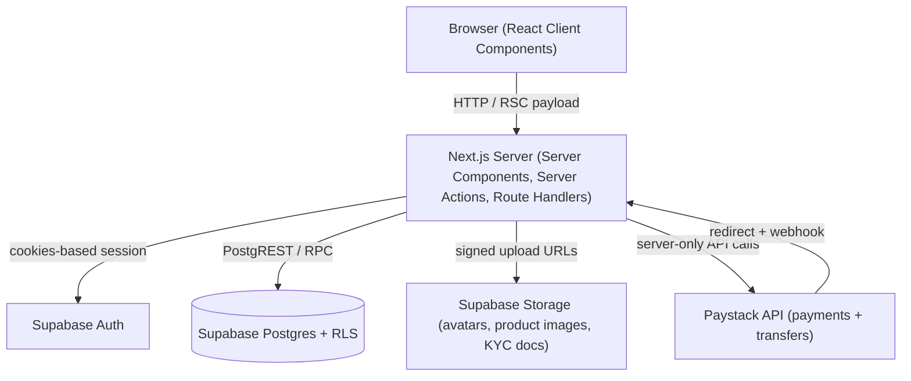
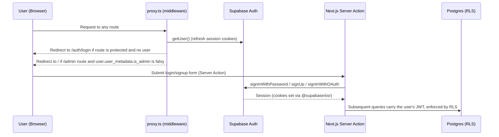

# AgriMarket Nigeria — Project Technical Report

**Project type:** Full-stack Next.js web application
**Domain:** Direct farm-to-buyer agricultural marketplace (Nigeria)
**Report basis:** Static analysis of the source code in this repository (`src/`, `supabase/migrations/`, configuration files) as of the current commit. No functionality is described unless it was directly observed in code.

---

## 1. System Design and Implementation

### 1.1 System Overview

AgriMarket is a two-sided marketplace that connects Nigerian farmers directly with buyers of fresh produce. The application, as implemented, supports:

- Public browsing of a product marketplace and a farmer directory (no login required).
- Buyer accounts that can add products to a cart, check out, pay online, track orders, confirm delivery, and favorite farmers.
- Farmer accounts (an upgrade path from a buyer account) that complete a KYC (Know Your Customer) verification process, list and manage products, fulfill incoming orders, and configure a bank payout account.
- An admin role that reviews farmer KYC submissions, manages user accounts (ban/unban), and views platform-wide statistics, products, and orders.
- Server-side integration with Paystack (a Nigerian payment gateway) for both collecting payment from buyers and disbursing payouts to farmers.

The homepage (`src/app/page.tsx` and `src/components/sections/home/*`) is a marketing/landing page (Hero, Features, How It Works, Stats, FAQ, CTA sections) that funnels visitors toward the marketplace or sign-up.

### 1.2 Functional Requirements Implemented

Based on the routes, server actions, and database schema present in the codebase, the following functionality is implemented and working end-to-end:

| Area | Implemented functionality |
|---|---|
| Authentication | Email/password sign-up and login, Google OAuth, password reset via email, session persistence via cookies |
| Marketplace | Product listing with search, category filter, state/location filter, sorting, pagination, product detail modal, a public farmer directory and farmer detail pages |
| Cart & Checkout | Client-side persistent cart (Zustand), checkout form with delivery details, server-side re-validation of cart contents/pricing, Paystack transaction initialization and verification |
| Order fulfillment | Farmer-side order item status progression (pending → accepted → preparing → in_transit → delivered), farmer cancellation, buyer delivery confirmation that triggers an automatic payout |
| Farmer onboarding | "Become a farmer" flow, KYC document upload and submission, KYC status badge, admin approve/reject workflow |
| Payouts | Bank account entry with Paystack account resolution, transfer recipient creation, automatic funds transfer to the farmer on delivery confirmation, webhook-based settlement of async transfer results |
| Admin | Dashboard with platform stats, user list with ban/unban, farmer list with KYC review, product list, order list |
| Favorites | Buyers can favorite/unfavorite farmers; favorited farmers' products are surfaced first in the marketplace |
| Calling | A buyer and farmer can see each other's phone number once an order item is active (not for pending/cancelled items), via `CallButton.tsx` and dedicated database functions |

Two route constants exist for **"Messages"** (`/dashboard/messages`) and **"Analytics"** (`/dashboard/analytics`) in `src/lib/routes.ts`, but no corresponding pages exist under `src/app/dashboard/`. These are **planned but not implemented** — the links are defined but nothing renders at those paths and no dashboard tab currently points to them (see Section 11).

A product `rating` field exists in the `Product` type (`src/lib/data/products.ts`) and is rendered/sorted on in `ProductCard.tsx` and `MarketplaceView.tsx`, but there is no `rating` column in the `products` table (see `0003_products.sql`) and no reviews/ratings table anywhere in the migrations. This is a **partially implemented / effectively dormant feature** — the UI path exists, but the value is always `undefined` in practice, so the star rating never renders and rating-based sorting is a no-op.

### 1.3 User Interface Design

- **Structure:** The application uses the Next.js App Router (`src/app/`) with route groups for `auth/`, `dashboard/`, `admin/`, `marketplace/`, and `checkout/`. Each area has its own layout composed from shared components (`Header`, `Footer`, `DashboardLayout`, `AdminLayout`, `AuthLayout`).
- **Navigation:** `Header.tsx` renders a sticky/transparent-on-scroll top navigation with marketplace, about, how-it-works, and FAQ anchors, a cart icon with a live item-count badge, and a user menu (or login/signup buttons) that adapts to authentication and role state (buyer/farmer/admin). Dashboard and admin sections use a horizontal tab bar (`DashboardLayout.tsx`, `AdminLayout.tsx`) driven by `usePathname()` for the active-tab highlight.
- **Responsive design:** Tailwind CSS v4 utility classes with responsive breakpoints (`md:`, `lg:`, `xl:`) are used throughout — e.g., `MarketplaceView.tsx`'s filter bar stacks vertically on mobile and horizontally on desktop, and the mobile navigation collapses into a slide-out drawer (`AnimatePresence`/`framer-motion`) below the `lg` breakpoint.
- **Reusable UI patterns:** A shared `Button` component (`src/components/ui/Button.tsx`) with variants (primary/secondary/ghost), a shared `Avatar`/`AdminAvatar`, a `VerificationBadge` for KYC status, `Pagination`, and modal patterns (`ProductModal`, `OrderItemDetailModal`) are reused across the app rather than re-implemented per page.
- **Forms and feedback:** Forms use React's `useActionState` hook bound to Next.js Server Actions (e.g. `LoginForm`, `SignupForm`, `CheckoutForm`, `ProductForm`, `BankDetailsForm`). Field-level validation errors are returned from the server action (Zod-validated) and rendered inline; toast notifications are shown via the `sonner` library (`<Toaster/>` mounted in `src/app/layout.tsx`).
- **Loading/error states:** The app defines Next.js special files `loading.tsx`, `error.tsx`, `global-error.tsx`, and `not-found.tsx` at the root, providing consistent branded loading and error screens across all routes.
- **Accessibility considerations identifiable in code:** `aria-label` attributes on icon-only buttons (cart toggle, mobile menu toggle), semantic form `<label htmlFor>` associations in forms such as `CheckoutForm.tsx`. No dedicated accessibility audit, ARIA live regions, or automated a11y testing were found — accessibility support beyond these basic patterns is **not explicitly identified in the codebase**.

### 1.4 System Implementation

The design is implemented as a full-stack Next.js application where nearly all backend logic lives in **Server Actions** (`"use server"` files) and **Route Handlers**, with Supabase as the sole persistence and identity layer.

- **Components:** Client components (`"use client"`) are used only where interactivity is required (forms, filters, cart, modals, header). Data-fetching pages are React Server Components that call functions in `src/lib/data/*` directly.
- **Pages:** Each feature area has server-rendered pages that fetch data server-side (via `createClient()` from `src/lib/supabase/server.ts`) and pass it as props to client components for interactivity (e.g. `src/app/marketplace/page.tsx` fetches products and favorites, then renders `MarketplaceView`).
- **Services:** `src/lib/paystack.ts` centralizes all Paystack HTTP calls (initialize transaction, verify transaction, list banks, resolve account, create transfer recipient, initiate transfer). `src/lib/supabase/{client,server,middleware,admin}.ts` centralize all Supabase client construction for each execution context (browser, server component, middleware, service-role/admin).
- **API integrations:** One external HTTP API is integrated — Paystack, for payment collection and payout transfers — plus the Supabase platform (Auth, Postgres via PostgREST, Storage).
- **State management:** Global client state is limited to the shopping cart (Zustand, persisted to `localStorage` under the key `agrimarket-cart`, see `src/store/cart.ts`) and the authenticated user (`useUser` hook wrapping Supabase's `onAuthStateChange`). All other state is server-derived (props from Server Components) or local component state (`useState`).
- **Data fetching:** Server Components query Supabase directly via typed helper functions in `src/lib/data/`; there is no client-side data-fetching library (no SWR/React Query/tRPC) and no client-exposed generic REST/GraphQL API beyond the one webhook route.
- **Validation:** All form inputs are validated server-side with Zod schemas (`src/lib/validations/*.ts`) before touching the database; error messages are mapped back to individual form fields via `flattenZodErrors`.
- **Authentication:** Supabase Auth (email/password + Google OAuth), with session cookies refreshed on every request by the Next.js middleware equivalent (`src/proxy.ts` → `src/lib/supabase/middleware.ts`).
- **Server-side functionality:** Nearly 20 `"use server"` action files implement all mutations (auth, profile, farmer onboarding, product CRUD, checkout, order fulfillment, payouts, admin moderation). Two Route Handlers exist for OAuth/callback style flows that must run outside the Server Action model: `src/app/auth/callback/route.ts` (Supabase OAuth/email-confirmation code exchange), `src/app/checkout/callback/route.ts` (Paystack redirect-based payment verification), and `src/app/api/paystack/webhook/route.ts` (server-to-server Paystack event handling).

---

## 2. Technologies Used

| Technology | Purpose | How It Is Used |
|---|---|---|
| Next.js 16 (App Router) | Application framework | Routing, Server Components, Server Actions, Route Handlers, middleware (`proxy.ts`), built-in image/font/metadata optimization |
| React 19 | UI development | Component tree for every page; `useActionState` for form/server-action wiring |
| TypeScript | Type safety | Used throughout `src/`; `strict` mode enabled in `tsconfig.json` |
| Supabase (`@supabase/supabase-js`, `@supabase/ssr`) | Backend-as-a-service (auth, database, storage) | Postgres access via PostgREST, session-aware SSR clients, file storage buckets, RPC calls to custom Postgres functions |
| Zod | Schema validation | Validates every form submission server-side before database writes (`src/lib/validations/*`) |
| Zustand | Client state management | Persisted shopping cart store (`src/store/cart.ts`) |
| Tailwind CSS v4 | Styling | Utility-first styling with a custom design-token theme defined in `globals.css` (`@theme inline`), custom component classes (`.input-class`, `.h1`–`.p3`) |
| Framer Motion | Animation | Header scroll transitions, mobile menu drawer, marketplace grid stagger animation, cart drawer transitions |
| react-icons | Iconography | Icon set used across headers, forms, badges, and buttons (Heroicons variants) |
| sonner | Toast notifications | Global `<Toaster/>` mounted in the root layout for success/error feedback |
| Paystack REST API | Payments | Transaction initialization/verification (checkout) and Transfers API (farmer payouts), called from `src/lib/paystack.ts` |
| babel-plugin-react-compiler / `reactCompiler: true` | Build-time optimization | Enabled in `next.config.ts`; auto-memoizes components at compile time |
| ESLint (`eslint-config-next`) | Code quality/linting | Configured in `eslint.config.mjs` using Next's core-web-vitals and TypeScript rule sets |

### 2.1 Frontend Technologies
Next.js (App Router), React 19, TypeScript, Tailwind CSS v4, Framer Motion, react-icons, sonner.

### 2.2 Backend / Server Technologies
Next.js Server Actions and Route Handlers (no separate backend service); Supabase Postgres accessed through PostgREST and Postgres RPC functions (`SECURITY DEFINER` functions defined in migrations).

### 2.3 Database Technologies
PostgreSQL, provisioned and managed through Supabase, with Row Level Security (RLS) policies and custom SQL functions/triggers as the primary authorization mechanism (see Section 4.4 and 6).

### 2.4 Authentication Technologies
Supabase Auth: email/password, Google OAuth, `@supabase/ssr` for cookie-based session handling across middleware, Server Components, and the browser.

### 2.5 Styling and UI Technologies
Tailwind CSS v4 (via `@tailwindcss/postcss`), a custom CSS-variable-based design token system in `globals.css`, `next/font/local` for the Figtree font family, Framer Motion for interaction/animation.

### 2.6 State Management
Zustand (global, persisted cart state only); everything else is React local state or server-derived props — there is no global app-wide store beyond the cart.

### 2.7 Data Fetching and API Communication
Server Components query Supabase directly (no client-side fetching library); mutations go through Next.js Server Actions invoked from `<form action={...}>` and `useActionState`; the only outbound third-party HTTP API calls are to Paystack, made from server-only modules.

### 2.8 Testing Tools
**None identified.** No test runner, test files (`*.test.*`, `*.spec.*`), or testing library appears in `package.json` or the repository. See Section 7.

### 2.9 Development and Deployment Tools
pnpm (via `pnpm-lock.yaml` / `pnpm-workspace.yaml`) as the package manager, ESLint for linting, TypeScript compiler for type-checking (`noEmit: true`, used for type checking only — Next.js handles the actual build). The README and `.env.example` (`NEXT_PUBLIC_SITE_URL` comment) indicate the project is intended for deployment on **Vercel**, but no `vercel.json` or other explicit deployment/CI configuration file is present.

---

## 3. Modularity of the System

### 3.1 Module Structure

The codebase is organized into clear functional modules, each with its own routes, server actions, and (where applicable) dedicated data-access functions:

- **Authentication module** — `src/app/auth/*`, `src/lib/validations/auth.ts`
- **Marketplace module** (public browsing) — `src/app/marketplace/*`, `src/components/marketplace/*`, `src/lib/data/products.ts`, `src/lib/data/publicFarmers.ts`
- **Cart & Checkout module** — `src/store/cart.ts`, `src/app/checkout/*`, `src/components/checkout/*`
- **Dashboard module** (buyer + farmer self-service) — `src/app/dashboard/*`, `src/components/dashboard/*`
- **Farmer onboarding/KYC sub-module** — `becomeFarmer`/`submitKyc` actions, `verification` page, `KycUploadForm`, `KycReviewActions`
- **Order fulfillment sub-module** — `src/app/dashboard/orders/*`, `src/app/dashboard/my-orders/*`, `src/lib/data/orders.ts`
- **Payouts sub-module** — `src/app/dashboard/payout-settings/*`, `src/lib/paystack.ts` (transfer functions)
- **Administration module** — `src/app/admin/*`, `src/components/admin/*`, `src/lib/data/admin.ts`
- **Payments integration module** — `src/lib/paystack.ts`, `src/app/api/paystack/webhook/route.ts`, `src/app/checkout/callback/route.ts`

There is no explicit "Notifications" or "Messages" module despite a route constant existing for it (unimplemented, see Section 1.2/11).

### 3.2 Component Modularity

UI is decomposed into small, single-purpose components grouped by feature folder (`components/auth`, `components/dashboard`, `components/marketplace`, `components/admin`), plus a `components/ui` folder for generic primitives (currently just `Button.tsx`). Composite pages (e.g. `src/app/dashboard/products/page.tsx`) assemble these smaller components rather than containing large monolithic JSX trees. Presentational components (e.g. `ProductCard`, `OrderItemStatusBadge`, `VerificationBadge`) are pure/reusable and accept typed props derived from the `src/lib/data/*` domain types.

### 3.3 Business Logic Separation

Business/domain logic — status transition rules (`FARMER_STATUS_SEQUENCE`), platform fee computation (`PLATFORM_FEE_RATE`, `summarizeFarmerEarnings`), and authorization checks (`requireAdmin` in `src/app/admin/actions.ts`) — lives in `src/lib/data/*.ts` and the `"use server"` action files, not in UI components. Components generally only format and display data or dispatch actions; they do not contain conditional business rules such as fee percentages or valid status transitions.

### 3.4 Data Layer

Database access is centralized: every Supabase query used for reading data lives in `src/lib/data/{products,orders,farmer,admin,publicFarmers}.ts`, which map raw Postgres rows into typed domain objects (e.g. `mapProductRow`, `mapOrderRow`). UI components never issue raw Supabase queries directly for read paths; they receive already-shaped data as props from Server Components. Mutations go through the `"use server"` action files, which perform their own authorization checks and Zod validation before calling Supabase.

### 3.5 State Management

State is deliberately minimal and split by scope:
- **Persisted global client state:** the cart only (Zustand + `localStorage`).
- **Ephemeral global client state:** the authenticated user object, via a small custom hook (`useUser`) rather than a context provider or store.
- **Server state:** everything else (products, orders, farmer profiles, admin stats) is fetched fresh per request in Server Components and passed down as props — there is no client-side cache/store duplicating this data.

### 3.6 Maintainability

The module boundaries described above support maintainability in concrete, observable ways:
- **Reusability:** shared query functions (e.g. `getAllOrders` is reused by both `getAllOrdersForAdmin` and `getAllProductsForAdmin`'s revenue calculation) avoid duplicated Supabase queries.
- **Scalability of features:** new order statuses were added incrementally via migrations (`0005_order_completed_status.sql`) without restructuring the order data layer, and new admin capabilities were layered on top of existing RLS policies (`0007_admin.sql`) rather than requiring a parallel access path.
- **Security-by-construction:** repeated use of the same `SECURITY DEFINER` Postgres function pattern (migrations `0009`, `0011`, `0012`, `0013`, `0014`) to safely expose narrow slices of otherwise RLS-protected data shows a consistent, auditable convention rather than one-off exceptions.
- **Testing:** the separation of pure data-mapping functions (e.g. `mapOrderRow`, `summarizeFarmerEarnings`) from I/O could support unit testing, but as noted in Section 2.8/7, no tests currently exist to exercise this.

---

## 4. System Architecture

### 4.1 Architectural Overview

AgriMarket is implemented as a **full-stack, server-rendered Next.js application backed by a Backend-as-a-Service (Supabase)**. It does not have a separate custom backend server/process — all "backend" logic (authorization, business rules, third-party API calls) executes inside Next.js Server Actions and Route Handlers, which run in the same deployable unit as the frontend. This is best characterized as a **Jamstack / full-stack Next.js architecture with a managed Postgres+Auth+Storage backend**, rather than a classic three-tier or microservices architecture.



### 4.2 Frontend Architecture

- **Structure:** Next.js App Router under `src/app/`, using nested folders to express routes (`app/dashboard/products/[id]/edit/page.tsx`, `app/marketplace/farmers/[id]/page.tsx`).
- **Routing:** File-system based routing; dynamic segments (`[id]`) used for product edit pages and farmer detail pages.
- **Layouts:** No shared `layout.tsx` per section; instead, reusable layout *components* (`DashboardLayout`, `AdminLayout`, `AuthLayout`) are explicitly rendered by each page. The single root `layout.tsx` only sets up fonts, global metadata, and the toaster.
- **Server/client component usage:** Data-heavy pages default to Server Components; interactive leaf components (forms, filters, drawers, menus) are explicitly marked `"use client"`.
- **State management:** Described in Section 3.5.
- **Data fetching:** Server Components call `src/lib/data/*` functions directly during render; no client-side fetch calls to internal API routes for normal data display.

### 4.3 Backend Architecture

There is no standalone backend service. Backend responsibilities are fulfilled by:
1. **Next.js Server Actions** (`"use server"` files) — the primary mechanism for all mutations (auth, product CRUD, checkout, order status changes, payouts, admin moderation).
2. **Next.js Route Handlers** — used only where a Server Action cannot apply (OAuth/email-confirmation code exchange, Paystack redirect callback, Paystack webhook).
3. **Supabase Postgres functions** — a meaningful share of "backend logic" is pushed into the database itself as SQL functions (`is_admin()`, `is_farmer_verified()`, `get_public_farmers()`, `get_farmer_recipient_code()`, `get_order_farmer_phones()`), invoked from the application via `supabase.rpc(...)`.

### 4.4 Database Architecture

**Technology:** PostgreSQL via Supabase, versioned as 14 sequential SQL migration files in `supabase/migrations/`.

**Main entities/tables:**

| Table | Key columns | Purpose |
|---|---|---|
| `auth.users` (Supabase-managed) | `raw_user_meta_data` (name, phone, role flags, avatar) | Identity for all account types; role is encoded via `is_farmer`/`is_admin` boolean flags in user metadata, not a separate `role` column |
| `farmer_profiles` | `id` (FK to `auth.users`), `farm_name`, `state`, `phone`, `kyc_status`, `kyc_documents` (jsonb), bank fields, `paystack_recipient_code` | One row per farmer; KYC and payout account state |
| `products` | `farmer_id` (FK), `name`, `category`, `price`, `unit`, `quantity`, `images` (jsonb), `location`, `address`, `is_active` | Farmer-listed produce |
| `orders` | `buyer_id`, `total_amount`, delivery fields, `contact_phone`, `payment_reference`, `payment_status` | One row per checkout/payment transaction |
| `order_items` | `order_id`, `buyer_id`, `farmer_id`, `product_id`, pricing snapshot fields, `status`, payout fields (`payout_status`, `platform_fee_amount`, `payout_amount`) | One row per product line within an order; the unit of fulfillment and payout |
| `farmer_favorites` | `buyer_id`, `farmer_id` (composite PK) | Buyer-to-farmer favoriting |

**Relationships:** `farmer_profiles.id` → `auth.users.id` (1:1); `products.farmer_id` → `farmer_profiles.id` (1:many); `orders.buyer_id` → `auth.users.id` (1:many); `order_items.order_id` → `orders.id`, `order_items.product_id` → `products.id` (nullable, `on delete set null`, so historical order items survive product deletion), `order_items.farmer_id` → `farmer_profiles.id`; `farmer_favorites` is a many-to-many join table between buyers and farmers.

**Data access patterns:** All application reads/writes go through Supabase's PostgREST layer using the `@supabase/supabase-js` query builder — there is no raw SQL executed from application code except within the migration files themselves. Cross-table reads that RLS would otherwise block (e.g. showing a farmer's public name to an anonymous visitor) are handled via `SECURITY DEFINER` SQL functions rather than by relaxing RLS policies (see Section 4.4/6). Storage: three Supabase Storage buckets — `avatars` (public), `product-images` (public), `kyc-documents` (private, owner + admin only).

No ORM is used; no explicit connection pooling configuration is present in application code (Supabase/PostgREST manages this).

### 4.5 Authentication Architecture



- **Providers:** Email/password and Google OAuth (`supabase.auth.signInWithOAuth({ provider: "google" })`), both handled by Supabase Auth.
- **Session management:** Cookie-based sessions refreshed on every request in `src/lib/supabase/middleware.ts` (`updateSession`), matched against nearly all routes via the `proxy.ts` matcher.
- **Protected routes:** `/dashboard`, `/checkout`, and `/admin` prefixes require a logged-in user (enforced in middleware); unauthenticated visitors are redirected to `/auth/login?redirect=<original path>`.
- **Authorization/roles:** Role is not a dedicated table but boolean flags in `user_metadata` (`is_farmer`, `is_admin`) baked into the JWT at sign-in. Admin routes additionally check `user.user_metadata.is_admin` in middleware, and admin Server Actions re-check it via `requireAdmin()` before executing (defense in depth — the UI-level middleware check and the server-action-level check are independent).
- **Email verification:** New sign-ups require confirming their email before login (`signup` action's success message: "Check your email to confirm your address before logging in"), handled entirely by Supabase Auth's built-in confirmation flow and `src/app/auth/callback/route.ts`.
- **Password recovery:** `requestPasswordReset` / `updatePassword` actions implement a standard forgot-password → emailed link → reset-password flow via `supabase.auth.resetPasswordForEmail` / `updateUser`.
- **OAuth/social login:** Google only, gated on the Supabase dashboard provider configuration (not verifiable from this codebase, per the comment in `auth/actions.ts`).

### 4.6 API Architecture

**Internal APIs (Route Handlers):**

| Route | Method | Purpose |
|---|---|---|
| `/auth/callback` | GET | Exchanges an OAuth/email-confirmation code for a session |
| `/checkout/callback` | GET | Verifies a Paystack transaction after the buyer is redirected back, updates `orders.payment_status` |
| `/api/paystack/webhook` | POST | Server-to-server event handling for `charge.success`, `transfer.success`, `transfer.failed`, `transfer.reversed`, secured by HMAC-SHA512 signature verification against `PAYSTACK_SECRET_KEY` |

**External APIs:** Paystack REST API (`https://api.paystack.co`) — transaction initialize/verify, bank list, account resolve, transfer recipient creation, transfer initiation. All calls originate from server-only code (`src/lib/paystack.ts`) and never expose `PAYSTACK_SECRET_KEY` to the client.

**Request/response flow and error handling:** Route Handlers return `NextResponse.redirect(...)` (for the two callback routes) or `NextResponse.json(...)` (for the webhook), with explicit status codes for invalid signatures (401) and misconfiguration (500). Server Actions return a typed state object (e.g. `{ error, fieldErrors, success }`) rather than throwing, so the UI can render inline errors without a full page error boundary. There is no client-facing REST/GraphQL API for the rest of the application's data — Server Components fetch data in-process.

### 4.7 Data Flow

Representative flow — a buyer purchasing produce:

```mermaid
flowchart LR
    A["Buyer browses /marketplace"] --> B["Adds product to cart (Zustand, localStorage)"]
    B --> C["Buyer fills CheckoutForm"]
    C --> D["initiateCheckout Server Action"]
    D --> E["Re-fetch authoritative price/product data from Postgres"]
    E --> F["Insert orders + order_items rows"]
    F --> G["initializePaystackTransaction()"]
    G --> H["Redirect to Paystack hosted checkout"]
    H --> I["/checkout/callback verifies transaction"]
    I --> J["orders.payment_status = paid"]
    J --> K["Farmer sees item in /dashboard/orders (advanceOrderItem)"]
    K --> L["Buyer confirms delivery (confirmOrderItemDelivery)"]
    L --> M["order_items.status = completed + Paystack transfer to farmer"]
```



A second, asynchronous flow exists in parallel: the Paystack **webhook** (`/api/paystack/webhook`) independently confirms `charge.success` (in case the buyer never returns to the browser) and settles `transfer.success`/`transfer.failed` events once Paystack finishes processing a payout asynchronously — something the synchronous `confirmOrderItemDelivery` action cannot know at the moment it initiates the transfer.

---

## 5. Project Structure

```text
agrimarket/
├── src/
│   ├── app/                        # Next.js App Router routes
│   │   ├── admin/                  # Admin dashboard: overview, users, farmers, products, orders
│   │   ├── api/paystack/webhook/   # Paystack server-to-server webhook
│   │   ├── auth/                   # Login, signup, forgot/reset password, OAuth callback
│   │   ├── checkout/               # Checkout form, Paystack callback, success page
│   │   ├── dashboard/              # Buyer/farmer self-service: profile, orders, products, earnings, payouts, KYC
│   │   ├── marketplace/            # Public product browsing + farmer directory
│   │   ├── layout.tsx, error.tsx, global-error.tsx, loading.tsx, not-found.tsx
│   │   └── page.tsx                # Marketing homepage
│   ├── components/
│   │   ├── admin/                  # Admin-only UI (layout, avatar, ban toggle, KYC review actions)
│   │   ├── auth/                   # Auth forms and layout
│   │   ├── checkout/                # Checkout form and cart-clearing helper
│   │   ├── dashboard/               # Buyer/farmer dashboard widgets and forms
│   │   ├── marketplace/             # Product/farmer browsing UI (cards, modal, cart drawer, tabs)
│   │   ├── sections/home/           # Marketing landing-page sections
│   │   └── ui/                      # Generic reusable primitives (Button)
│   ├── hooks/                       # useUser (client-side auth state)
│   ├── lib/
│   │   ├── data/                    # Typed Supabase query functions per domain (products, orders, farmer, admin, publicFarmers)
│   │   ├── supabase/                 # Supabase client factories (browser, server, middleware, admin/service-role)
│   │   ├── validations/              # Zod schemas per form/domain
│   │   ├── avatar.ts, paystack.ts, routes.ts
│   ├── store/cart.ts                 # Zustand persisted cart store
│   └── proxy.ts                      # Next.js middleware entry (session refresh + route protection)
├── supabase/migrations/              # 14 versioned SQL migrations (schema, RLS policies, functions, triggers)
├── public/                           # Static assets (fonts, images)
├── next.config.ts, tsconfig.json, eslint.config.mjs, postcss.config.mjs
└── .env.example                      # Documents required environment variables (no secrets)
```

---

## 6. Security Implementation

The following mechanisms are actually present in the codebase:

- **Authentication:** Handled entirely by Supabase Auth (email/password with hashing managed by Supabase, Google OAuth). No custom password-hashing or session-token code is written in this application.
- **Session handling:** Cookie-based sessions managed by `@supabase/ssr`, refreshed on every request through `src/proxy.ts` / `src/lib/supabase/middleware.ts`, so a stale/expired token is proactively refreshed rather than left to fail on next use.
- **Route protection:** Middleware-level allowlist/denylist redirects unauthenticated users away from `/dashboard`, `/checkout`, and `/admin`, and redirects non-admins away from `/admin`.
- **Authorization at the data layer (Row Level Security):** Every application table has RLS enabled (`alter table ... enable row level security`), with explicit policies scoping `select`/`insert`/`update`/`delete` to the owning user (`auth.uid() = ...`) or to admins (`is_admin()`). This means authorization is enforced at the database layer, not only in application code — even if a Server Action's own check were bypassed, Postgres would still reject an unauthorized row-level write.
- **Defense in depth on admin actions:** Admin-only Server Actions (`src/app/admin/actions.ts`) independently re-verify `user.user_metadata.is_admin` via `requireAdmin()`, rather than relying solely on the middleware redirect.
- **Database-level guardrails beyond RLS:** A Postgres trigger (`prevent_self_kyc_approval`) blocks a farmer (or any non-admin authenticated user) from setting their own `kyc_status` to anything other than `pending`, closing a gap that column-level RLS alone could not (RLS operates per-row, not per-column).
- **Least-privilege data exposure via `SECURITY DEFINER` functions:** Rather than widening RLS policies to make cross-user reads work, the codebase repeatedly uses narrow SQL functions that run with elevated privilege internally but only ever return a small, deliberately chosen set of non-sensitive columns (e.g. `get_public_farmer_info` exposes only `farm_name`/`kyc_status`; `get_farmer_recipient_code` exposes only a Paystack recipient code; `get_order_farmer_phones` exposes a farmer's phone only to a buyer with an active, non-cancelled order with that farmer). This is a consistent, documented pattern across migrations 0009, 0011, 0012, 0013, and 0014.
- **Server-side input validation:** Every mutating Server Action validates its `FormData` against a Zod schema before touching the database (`src/lib/validations/*.ts`); client-side HTML validation attributes (e.g. `pattern`, `required`) exist as a UX convenience only and are not relied upon for security.
- **Server-side price/data integrity:** `initiateCheckout` explicitly re-fetches product price, name, image, and active status from the database rather than trusting any of that from the submitted cart payload — only product IDs and quantities are taken from the client.
- **Webhook authenticity:** The Paystack webhook route verifies an HMAC-SHA512 signature (`x-paystack-signature`) computed over the raw request body using `PAYSTACK_SECRET_KEY`, using a constant-time comparison (`crypto.timingSafeEqual`) to avoid timing side-channels, before trusting any event data. Malformed or unsigned payloads are rejected with 401/400.
- **Service-role key isolation:** The Supabase service-role (admin) client (`src/lib/supabase/admin.ts`) is documented and structured as server-only, bypasses RLS, and is explicitly required to only be called after an admin check has already been performed by the caller — this is a code-organization safeguard, not a runtime-enforced one (see Section 11).
- **Secrets handling:** `.env.example` documents required variables (`NEXT_PUBLIC_SUPABASE_URL`, `NEXT_PUBLIC_SUPABASE_ANON_KEY`, `SUPABASE_SERVICE_ROLE_KEY`, `PAYSTACK_SECRET_KEY`, `NEXT_PUBLIC_PAYSTACK_PUBLIC_KEY`, `NEXT_PUBLIC_SITE_URL`) without real values; `.env.local` is excluded from version control via `.gitignore`. No secret values are present anywhere in the reviewed source.
- **Storage access control:** Supabase Storage bucket policies restrict uploads to a path prefixed with the uploader's own user ID (`storage.foldername(name))[1] = auth.uid()`), for avatars, product images, and KYC documents; KYC documents additionally sit in a **private** bucket, readable only by the owning farmer or an admin.

**Not explicitly implemented / not verifiable from the codebase:**
- No explicit CSRF token mechanism is implemented; Server Actions rely on Next.js's built-in POST-based CSRF protections (framework-level, not custom application code) — no additional custom protection was found.
- No explicit XSS-sanitization layer was found beyond React's default output escaping; no `dangerouslySetInnerHTML` usage was observed in the reviewed files, which limits (but by design, not by an added control) this class of vulnerability.
- Rate limiting on auth endpoints, checkout, or the webhook is **not implemented** in application code (Supabase Auth may apply its own platform-level limits, which are outside this codebase).
- No dependency-vulnerability scanning or security headers configuration (e.g. CSP, `next.config.ts` `headers()`) was found.

The system should not be described as fully secure by virtue of using Supabase and RLS — RLS misconfigurations were in fact found and fixed during the project's own history (see `0011_fix_marketplace_visibility.sql`, which documents and repairs a real bug where nested RLS silently hid all products from everyone). This is evidence of iterative security hardening, not a claim of a complete security posture.

---

## 7. Testing and Quality Assurance

**No automated tests exist in this repository.** There is no test runner (Jest, Vitest, Playwright, Cypress, etc.) listed in `package.json`, no test configuration file, and no files matching `*.test.*` or `*.spec.*` anywhere under `src/` or the project root.

What quality assurance mechanisms *do* exist:
- **Static type checking:** TypeScript in `strict` mode (`tsconfig.json`), which catches a class of type-related bugs at build time.
- **Linting:** ESLint configured with `eslint-config-next`'s core-web-vitals and TypeScript rule sets (`eslint.config.mjs`), runnable via `pnpm lint`.
- **Input validation:** Zod schemas function as a runtime correctness check for all form-driven mutations, effectively guarding against malformed data reaching the database, though this is data validation rather than behavioral testing.
- **Evidence of manual/iterative testing during development:** Debug `console.log` statements remain in `src/app/dashboard/products/actions.ts` (`createProduct`/`updateProduct`) logging farmer IDs, image arrays, and raw Supabase error objects — these appear to be diagnostic logging left over from manual testing/debugging rather than intentional production logging, and are not gated behind an environment check.

There is no evidence of end-to-end testing, integration testing against a test Supabase instance, or component-level unit testing. Automated QA should be considered a gap rather than an implemented capability.

---

## 8. Deployment and Environment

- **Target platform:** The README (boilerplate, from `create-next-app`) and `.env.example`'s comment about `NEXT_PUBLIC_SITE_URL` (referencing `https://agri-market-v1.vercel.app`) indicate the project is intended to be deployed on **Vercel**, but no `vercel.json`, GitHub Actions workflow, or other CI/CD configuration file exists in the repository.
- **Build process:** Standard Next.js scripts in `package.json` — `dev`, `build`, `start`, `lint`. No custom build steps, no Dockerfile, no containerization configuration was found.
- **Environment configuration:** `.env.example` documents six environment variables required for the app to function (Supabase project URL/anon key, Supabase service-role key, Paystack secret/public keys, site URL). `next.config.ts` whitelists `*.supabase.co` as a remote image host (covering both public object URLs and signed URLs for private KYC documents), and enables `reactCompiler: true`.
- **Database migrations:** The 14 SQL files under `supabase/migrations/` are plain SQL intended to be run manually in the Supabase SQL editor (each file's header comment says "Run this once... before using..."), in numeric order. There is no CLI-driven or CI-driven migration runner (e.g. `supabase db push` in a pipeline) evidenced in the repository — migrations are applied by hand, sequentially, as documented in each file's own comments.
- **Secrets in deployment:** The service-role key and Paystack secret key are described in comments as server-only/production values to be set in the hosting platform's environment variable configuration (e.g. "In Vercel's project env vars, always set it to your real deployed origin").

No staging/production environment separation, feature flags, or infrastructure-as-code was found in the codebase.

---

## 9. System Workflow

### 9.1 Farmer onboarding and KYC

1. A logged-in buyer clicks "Become a Farmer" (`becomeFarmer` server action).
2. `farmer_profiles` row is created; `user_metadata.is_farmer` is set to `true`.
3. User is redirected to `/dashboard/verification` and uploads two documents (government ID, proof of farm) via `KycUploadForm` to the private `kyc-documents` bucket.
4. `submitKyc` action sets `kyc_status = 'pending'` and stores document URLs in `kyc_documents` (jsonb).
5. An admin opens `/admin/farmers/[id]`, reviews the documents (`KycReviewActions`), and calls `approveFarmerKyc` or `rejectFarmerKyc`.
6. On approval, `kyc_status = 'verified'` and `verified_at` is stamped — this is also the condition (`is_farmer_verified()`) that makes the farmer's products publicly visible in the marketplace.

### 9.2 Product listing

1. A verified farmer opens `/dashboard/products/new`, fills out `ProductForm` (name, category, price, unit, quantity, description, location/address, up to 5 images uploaded via `ProductImageUpload` to the public `product-images` bucket).
2. `createProduct` validates the payload with `productSchema`, inserts into `products`, and redirects back to the product list.
3. The product becomes visible on `/marketplace` only if `is_active = true` and the owning farmer's `kyc_status = 'verified'` (enforced by RLS + `is_farmer_verified()`).

### 9.3 Purchase and fulfillment

Described in full in Section 4.7 (Data Flow) — browse → cart → checkout → Paystack payment → farmer fulfillment steps → buyer delivery confirmation → automatic payout.

### 9.4 Admin moderation

1. Admin logs in with an account whose `user_metadata.is_admin = true` (set manually via SQL per `0007_admin.sql`'s instructions — there is no in-app way to grant admin).
2. Admin views `/admin` (platform stats from `getAdminStats`), `/admin/users` (ban/unban via the Supabase Auth Admin API), `/admin/farmers` (KYC queue), `/admin/products`, `/admin/orders`.
3. All admin data reads rely on RLS policies that grant admins blanket `select` access (`0007_admin.sql`); the user list additionally requires the service-role client, since `auth.users` cannot be listed through the regular client.

---

## 10. Technical Challenges and Solutions

Based on evidence directly present in the migration comments and code (not speculative), the following real technical challenges were encountered and solved:

1. **Nested RLS silently blocking legitimate public reads.** `0011_fix_marketplace_visibility.sql` documents that a `select` policy on `products` using an `exists (select 1 from farmer_profiles ...)` subquery was itself subject to `farmer_profiles`' own RLS, so the subquery evaluated to `false` for every visitor except the farmer themselves or an admin — meaning *no one* could ever see anyone else's products on the marketplace. It was solved with a `SECURITY DEFINER` function (`is_farmer_verified`) that deliberately bypasses RLS internally while only ever returning a boolean.
2. **Exposing narrow, safe slices of otherwise-protected data.** The same class of problem recurred for public farmer names/avatars (`get_public_farmer_info`, `get_public_farmers`, `get_public_farmer`), payout recipient codes needed during buyer-initiated delivery confirmation (`get_farmer_recipient_code`), and phone numbers for active-order calling (`get_order_farmer_phones`). Each was solved with a purpose-built `SECURITY DEFINER` SQL function rather than a blanket RLS relaxation — a consistent architectural response to the same underlying constraint.
3. **Preventing self-approval of KYC while still allowing admin approval.** A trigger-based guard (`prevent_self_kyc_approval`) was introduced because RLS alone cannot restrict which *columns* a permitted `update` touches; it was later revised (`0007_admin.sql`) to add an `is_admin()` exception once an admin approval flow was introduced, without reopening the door for farmers to self-approve.
4. **Avatar precedence across OAuth re-syncs.** Google OAuth re-populates `avatar_url`/`picture` into `user_metadata` on every sign-in, which would silently clobber a user-uploaded profile photo. This was solved by storing user uploads under a distinct key (`custom_avatar_url`) and resolving display precedence in one shared helper (`src/lib/avatar.ts`), used consistently across the header, admin views, and public farmer data.
5. **Synchronizing payment state across two different completion signals.** A payment can complete either via the buyer being redirected back to `/checkout/callback` or, if that never happens (closed tab, dropped connection), via the asynchronous Paystack webhook. Both paths update `orders.payment_status`, and the webhook path includes an explicit `.eq("payment_status", "pending")` guard so it is a safe no-op if the callback already handled it.
6. **Modeling a delayed/async payout as part of the order lifecycle.** A farmer payout can be immediate (`status: "success"` from `initiateTransfer`) or asynchronous (`"processing"`, resolved later via the `transfer.success`/`transfer.failed` webhook events) — the schema (`payout_status` enum) and the webhook handler both account for this, rather than assuming a payout is synchronous.

---

## 11. Limitations and Areas for Improvement

### Current limitations (as implemented today)

- **No automated testing** of any kind (Section 7).
- **No client-facing product review/rating system**, despite UI plumbing (`rating` field, star icon, "Highest Rated" sort option) already present in `ProductCard`/`ProductModal`/`MarketplaceView` — the field is never populated from the database, so this UI path is currently dead weight.
- **Two dashboard routes are defined but not built:** `pageRoutes.dashboard.messages` and `pageRoutes.dashboard.analytics` exist in `src/lib/routes.ts` with no corresponding page and are not linked from `DashboardLayout`'s tab list — they appear to be reserved for future features.
- **Manual, non-versioned-in-tooling database migrations** — the 14 SQL files must be run by hand in order; there is no migration-runner integration (e.g. Supabase CLI in CI) to guarantee a given deployment's schema matches the code that expects it.
- **No in-app path to grant the admin role** — the first admin account must be created via direct SQL against `auth.users`, as documented in `0007_admin.sql`'s comment block.
- **Debug logging left in production code** — `console.log` statements in `src/app/dashboard/products/actions.ts` log internal identifiers and raw error objects unconditionally.
- **No rate limiting** on authentication, checkout, or the public Paystack webhook endpoint at the application level.
- **No automated dependency/security scanning** or documented incident-response process.

### Potential improvements

- Add an automated test suite, at minimum covering the pure data-mapping and fee-calculation functions in `src/lib/data/orders.ts` (`summarizeFarmerEarnings`, status-sequence logic), which are already structured as testable pure functions.
- Either implement a real ratings/reviews feature (schema + submission flow) or remove the currently-inert rating UI to avoid a misleading empty state.
- Move database migrations into a CLI/CI-managed pipeline (e.g. the Supabase CLI's migration commands) to remove the manual-application risk.
- Introduce a proper role/permissions table instead of encoding roles as ad hoc boolean flags on `user_metadata`, which is harder to query, audit, and extend (e.g. a future third role) than a dedicated table.
- Add structured, environment-gated logging (or remove the existing `console.log` calls) in `dashboard/products/actions.ts`.
- Add basic rate limiting to the authentication and webhook endpoints, given they are the most exposed unauthenticated surfaces.

### Features that appear incomplete

- Order/product "Messages" and farmer "Analytics" (route constants exist, no implementation).
- Product rating/review display (UI exists, no data source).

---

## 12. Conclusion

AgriMarket Nigeria is a functionally complete, production-shaped two-sided marketplace built entirely on Next.js (App Router, Server Actions, Route Handlers) and Supabase (Auth, Postgres with Row Level Security, Storage), with Paystack handling both inbound payments and outbound farmer payouts. The implementation covers the full core loop — farmer KYC onboarding, product listing, cart/checkout, order fulfillment status tracking, and automatic escrow-style payout on delivery confirmation — along with an admin surface for moderation and oversight.

Architecturally, the system leans heavily on the database itself as an enforcement layer: Row Level Security policies, triggers, and a consistent pattern of narrowly-scoped `SECURITY DEFINER` functions carry a substantial share of the application's authorization logic, rather than concentrating all of it in application code. This is evidenced not just by the current schema but by the migration history itself, which documents and repairs a genuine RLS visibility bug (`0011`) — indicating the security model evolved iteratively rather than being fully correct from the start.

Modularity is achieved through consistent separation of concerns: typed data-access functions per domain (`src/lib/data/`), validation schemas per form (`src/lib/validations/`), and feature-scoped component/action groupings under `src/app/` and `src/components/`. State management is kept deliberately minimal (a single persisted cart store plus server-derived props), which keeps the client-side surface area small.

The most significant gap relative to a production-ready system is the complete absence of automated testing, alongside a small number of UI features (ratings, messages, analytics) that are scaffolded in routing/type definitions but not yet built out. Neither of these undermines what has been implemented, but both represent the clearest, most concrete next steps for the project.
